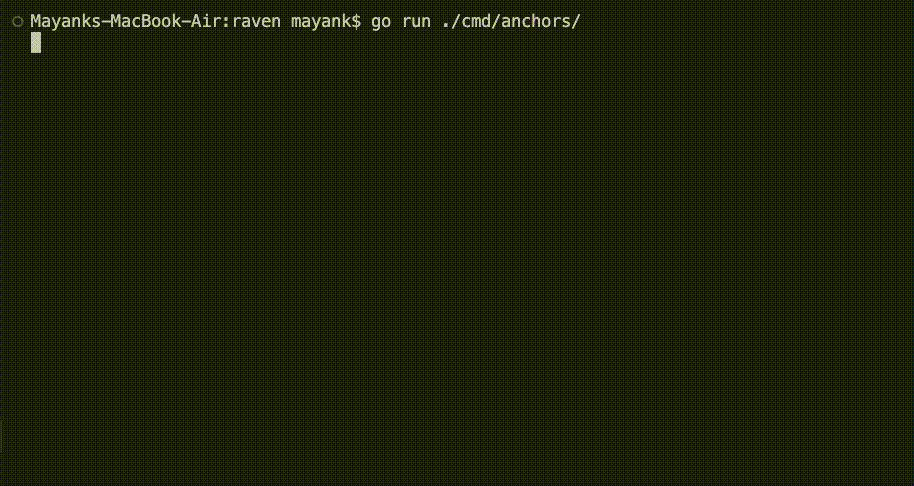

# Raven 🖤

A structured logging library for Go. Supports colored terminal output,
JSON formatting, live progress bars, and concurrent use out of the box.


## Anchored Lines



Log lines scroll normally while progress bars stay pinned at the bottom.
When output is piped to a file, anchoring turns off automatically and
transient lines are suppressed.

## Features

- Structured key-value fields on every log line
- Five log levels: Transient, Verbose, Info, Warning, Error
- Plain text and JSON output
- ANSI colors with three built-in palettes and full customization
- Live anchored lines for progress bars and status updates
- Safe for concurrent use
- Automatically detects terminals and disables colors when output is piped
- Respects the `NO_COLOR` environment variable
- No personal or third-party ANSI dependencies

## Installation

```bash
go get github.com/upadhyay1302/raven
```

## Quick Start

```go
log := raven.New(raven.Auto)
defer log.Close()

log.Info("server started", raven.Int("port", 8080))
log.Warning("high memory usage", raven.Float64("percent", 87.3))
log.Error("connection failed", raven.Err(err))
```

Output:
```
2026.05.31-11:00:00 [inf] server started       port=8080
2026.05.31-11:00:00 [WRN] high memory usage    percent=87.3
2026.05.31-11:00:00 [ERR] connection failed    error=connection refused
```

## Logger Styles

```go
raven.New(raven.Auto)    // detects terminal, enables colors and anchors
raven.New(raven.Direct)  // colors, no anchors, no buffering
raven.New(raven.Plain)   // plain text, no colors
raven.New(raven.JSON)    // one JSON object per line
```

JSON output:
```json
{"ts":"2026-05-31T11:00:00Z","level":"info","msg":"server started","port":8080}
```

## Fields

```go
raven.Bool("active", true)
raven.String("env", "production")
raven.Int("port", 8080)
raven.Int64("count", math.MaxInt64)
raven.Uint("id", 42)
raven.Uint64("max", math.MaxUint64)
raven.Float64("ratio", 3.14)
raven.Dur("latency", 2500*time.Millisecond)
raven.Time("started_at", time.Now())
raven.Err(err)
raven.Path("/var/log/app.log")
raven.Stringer("level", myStringer)
```

## Threshold Filtering

```go
log.SetThreshold(raven.Transient) // show everything
log.SetThreshold(raven.Verbose)   // hide Transient only
log.SetThreshold(raven.Info)      // hide Transient and Verbose (default)
log.SetThreshold(raven.Warning)   // show Warning and Error only
log.SetThreshold(raven.Error)     // show Error only
```

Filtered messages cost around 7ns and zero allocations, so it is safe
to leave verbose logging in production code.

## Child Loggers

Child loggers add context without touching the parent:

```go
// add static fields to every line
dbLog := raven.WithFields(log,
    raven.String("layer", "database"),
    raven.String("driver", "postgres"),
)
dbLog.Info("query executed", raven.Dur("took", 42*time.Millisecond))

// add printer options
quietLog := raven.WithOptions(log, raven.OptPalette(raven.MutedPalette))

// add both at once
auditLog := raven.WithContext(log,
    []raven.PrinterOption{raven.OptPalette(raven.BoldPalette)},
    []raven.Fielder{raven.String("audit", "true")},
)
```

## Anchored Lines

```go
log := raven.New(raven.Auto)
defer log.Close()

var wg sync.WaitGroup
for i := 0; i < 3; i++ {
    wg.Add(1)
    go func(anchor raven.Logger, id int) {
        defer wg.Done()
        defer raven.RemoveAnchor(anchor)
        for pct := 0; pct <= 100; pct++ {
            anchor.Transient("downloading",
                raven.Int("thread", id),
                raven.Int("percent", pct),
            )
            time.Sleep(50 * time.Millisecond)
        }
        log.Info("download complete", raven.Int("thread", id))
    }(raven.AddAnchor(log), i)
}
wg.Wait()
```

## Color Palettes

```go
raven.New(raven.Auto, raven.OptPalette(raven.DefaultPalette))
raven.New(raven.Auto, raven.OptPalette(raven.MutedPalette))
raven.New(raven.Auto, raven.OptPalette(raven.BoldPalette))

// customize individual levels
custom := raven.DefaultPalette.
    WithLevel(raven.Error, raven.Magenta, raven.DarkMagenta).
    WithLevel(raven.Warning, raven.Cyan, raven.DarkCyan)
raven.New(raven.Auto, raven.OptPalette(custom))
```

## Split Output with TeeLogger

Send logs to two destinations at the same time:

```go
file, _ := os.Create("app.log")
primary   := raven.NewBuffered(os.Stdout, true, &raven.TextPrinter{})
secondary := raven.NewUnbuffered(file, &raven.JSONPrinter{})

tee, stop := raven.NewTee(primary, secondary)
defer stop()

tee.Info("goes to both terminal and log file")
```

## Printer Options

```go
raven.New(raven.Auto,
    raven.OptShowTime(true),
    raven.OptShowLevel(true),
    raven.OptColumnOffset(40),
    raven.OptPalette(raven.BoldPalette),
    raven.OptMsgThenFields,
    raven.OptFieldsThenMsg,
    raven.OptMaxLineWidth(120),
)
```

## Benchmarks

Run on Intel Core i5-1030NG7 @ 1.10GHz:

```
Benchmark_UnbufferedJSON/fields=none/threshold=error      ~7 ns/op      0 B/op    0 allocs/op
Benchmark_UnbufferedJSON/fields=none/threshold=info    ~1298 ns/op    416 B/op    4 allocs/op
Benchmark_UnbufferedText/fields=none/threshold=error      ~7 ns/op      0 B/op    0 allocs/op
Benchmark_UnbufferedText/fields=none/threshold=info    ~1291 ns/op    432 B/op    6 allocs/op
Benchmark_BufferedText/fields=none/threshold=error        ~7 ns/op      0 B/op    0 allocs/op
Benchmark_BufferedText/fields=none/threshold=info      ~2611 ns/op    432 B/op    6 allocs/op
```

Messages filtered below threshold cost about 7ns with zero allocations.

```bash
./bench.sh
```

## Demos

```bash
go run ./cmd/demo/        # general demo with CLI flags
go run ./cmd/anchors/     # live progress bar demo
go run ./cmd/colortest/   # color palette showcase
go run ./cmd/lengthtest/  # long line cropping test
go run ./cmd/sizetest/    # terminal size detection
```

## Tests

```bash
go test -race ./...
go test -bench=. -benchmem ./...
./bench.sh
```

## Dependencies

| Package | Purpose |
|---|---|
| `golang.org/x/term` | Terminal size detection and TTY checks |
| `github.com/mattn/go-runewidth` | Column width for wide characters |

## License

MIT
